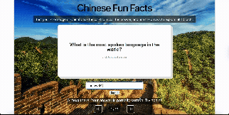

# Web Development Project 3 - *Basic Chinese Fun Facts*

Submitted by: **Sanjana Chauhan**

This web app: **To help people interested in Chinese culture and historyl learn some of the basic fun facts**

Time spent: **2** hours spent in total

## Required Features

The following **required** functionality is completed:

- [x] **The user can enter their guess into an input box *before* seeing the flipside of the card**
  - Application features a clearly labeled input box with a submit button where users can type in a guess
  - Clicking on the submit button with an **incorrect** answer shows visual feedback that it is wrong 
  -  Clicking on the submit button with a **correct** answer shows visual feedback that it is correct
- [x] **The user can navigate through an ordered list of cards**
  - A forward/next button displayed on the card navigates to the next card in a set sequence when clicked
  - A previous/back button displayed on the card returns to the previous card in the set sequence when clicked
  - Both the next and back buttons should have some visual indication that the user is at the beginning or end of the list (for example, graying out and no longer being available to click), not allowing for wrap-around navigation

The following **optional** features are implemented:

- [ ] Users can use a shuffle button to randomize the order of the cards
  - Cards should remain in the same sequence (**NOT** randomized) unless the shuffle button is clicked 
  - Cards should change to a random sequence once the shuffle button is clicked
- [x] A user’s answer may be counted as correct even when it is slightly different from the target answer
  - Answers are considered correct even if they only partially match the answer on the card 
  - Examples: ignoring uppercase/lowercase discrepancies, ignoring punctuation discrepancies, matching only for a particular part of the answer rather than the whole answer
- [ ] A counter displays the user’s current and longest streak of correct responses
  - The current counter increments when a user guesses an answer correctly
  - The current counter resets to 0 when a user guesses an answer incorrectly
  - A separate counter tracks the longest streak, updating if the value of the current streak counter exceeds the value of the longest streak counter 
- [ ] A user can mark a card that they have mastered and have it removed from the pool of displayed cards
  - The user can mark a card to indicate that it has been mastered
  - Mastered cards are removed from the pool of displayed cards and added to a list of mastered cards

The following **additional** features are implemented:

* [ ] List anything else that you added to improve the site's functionality!

## Video Walkthrough

Here's a walkthrough of implemented user stories:

GIF created with ...  Adobe Express

## Notes

Describe any challenges encountered while building the app.
I had to change how 'flipped' was implemented, since the answer shouldn't be input when the card shows the answer, I had to store that value a new way.