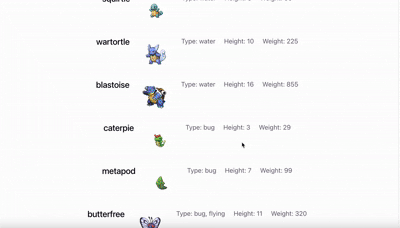

# Web Development Project 5 - *Name of App Here*

Submitted by: **Sanjana Chauhan**

This web app: **This web app uses**

Time spent: **3** hours spent in total

## Required Features

The following **required** functionality is completed:

- [x] **The site has a dashboard displaying a list of data fetched using an API call**
  - The dashboard should display at least 10 unique items, one per row
  - The dashboard includes at least two features in each row
- [x] **`useEffect` React hook and `async`/`await` are used**
- [x] **The app dashboard includes at least three summary statistics about the data** 
  - The app dashboard includes at least three summary statistics about the data, such as:
    - *Added an average height, length, and most common type*
- [x] **A search bar allows the user to search for an item in the fetched data**
  - The search bar **correctly** filters items in the list, only displaying items matching the search query
  - The list of results dynamically updates as the user types into the search bar
- [x] **An additional filter allows the user to restrict displayed items by specified categories**
  - The filter restricts items in the list using a **different attribute** than the search bar 
  - The filter **correctly** filters items in the list, only displaying items matching the filter attribute in the dashboard
  - The dashboard list dynamically updates as the user adjusts the filter

The following **optional** features are implemented:

- [ ] Multiple filters can be applied simultaneously
- [x] Filters use different input types
  - e.g., as a text input, a dropdown or radio selection, and/or a slider
- [ ] The user can enter specific bounds for filter values

The following **additional** features are implemented:

* [ ] List anything else that you added to improve the site's functionality!

## Video Walkthrough

Here's a walkthrough of implemented user stories:

 

## Notes

I learned more about API's, especially fetching multiple times since the PokeAPI didn't have all the information in one fetch, and I needed to fetch again per pokemoon url.
